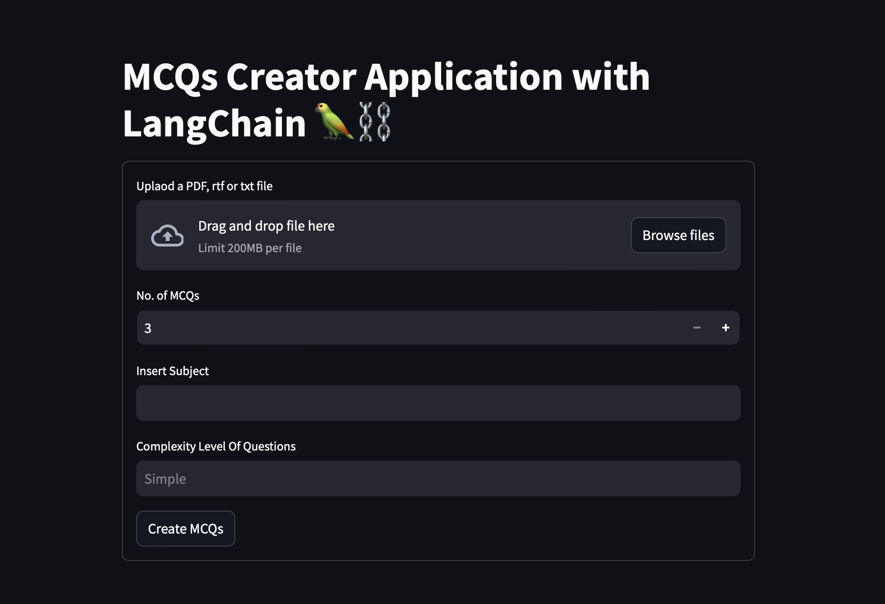
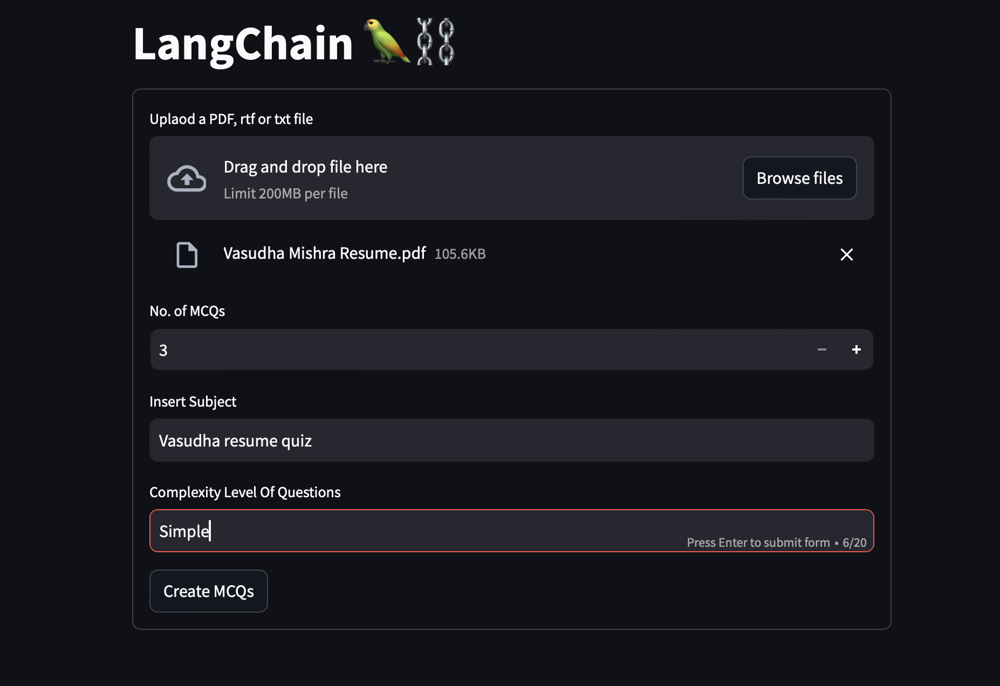
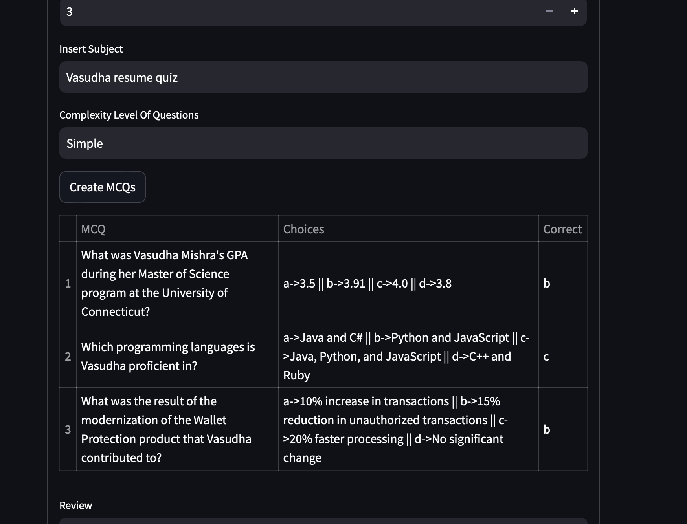

# MCQ Generator

## Project Overview

This project is a versatile application designed to generate Multiple Choice Questions (MCQs) automatically from various input content types. Users can upload documents (PDF, DOC, etc.) and specify parameters like the number of questions, quiz subject, and complexity level. The application leverages OpenAI's powerful language models to generate relevant MCQs with options and answers, making it ideal for educators, trainers, and anyone looking to create quizzes quickly and efficiently.

## Step1: Landing page

## Step 2: Upload any type of file: pdf, text, .doc. Provide subject of the quiz, and complexity of the quiz.

## Step 3: The app will generate quiz based on provided content.

## Future Enhancements

Support for Additional Languages: Expand support to generate quizzes in multiple languages.
Question Review and Editing: Allow users to manually edit questions and answers before finalizing the quiz.
Integration with LMS: Integrate with Learning Management Systems (LMS) for seamless quiz distribution.
Mobile App Version: Develop a mobile-friendly version for on-the-go quiz generation.
